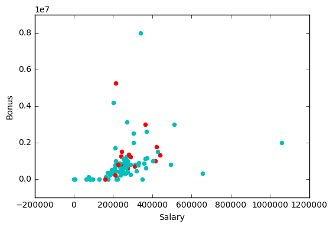
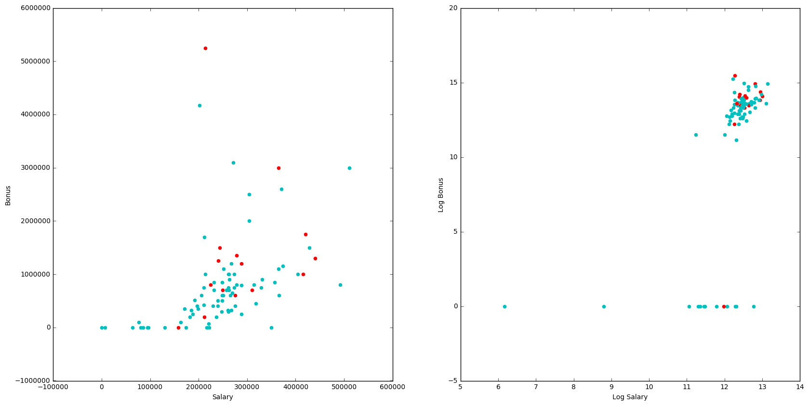
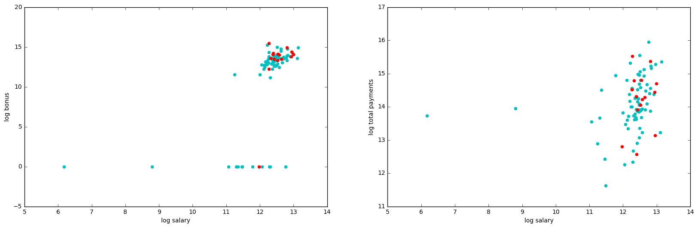
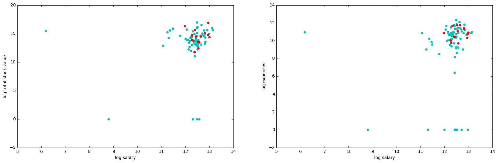
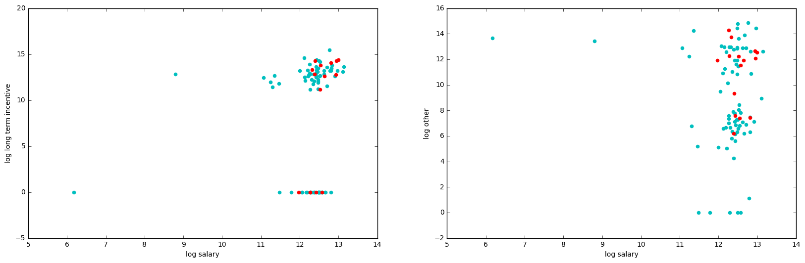
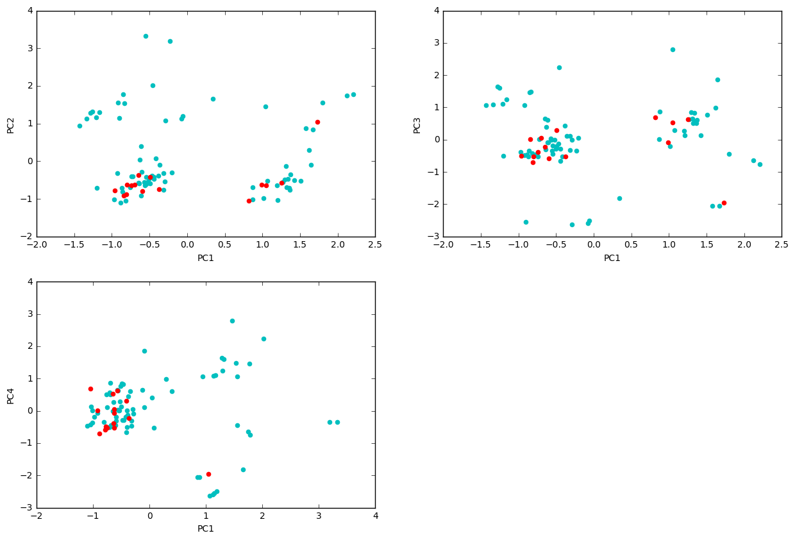
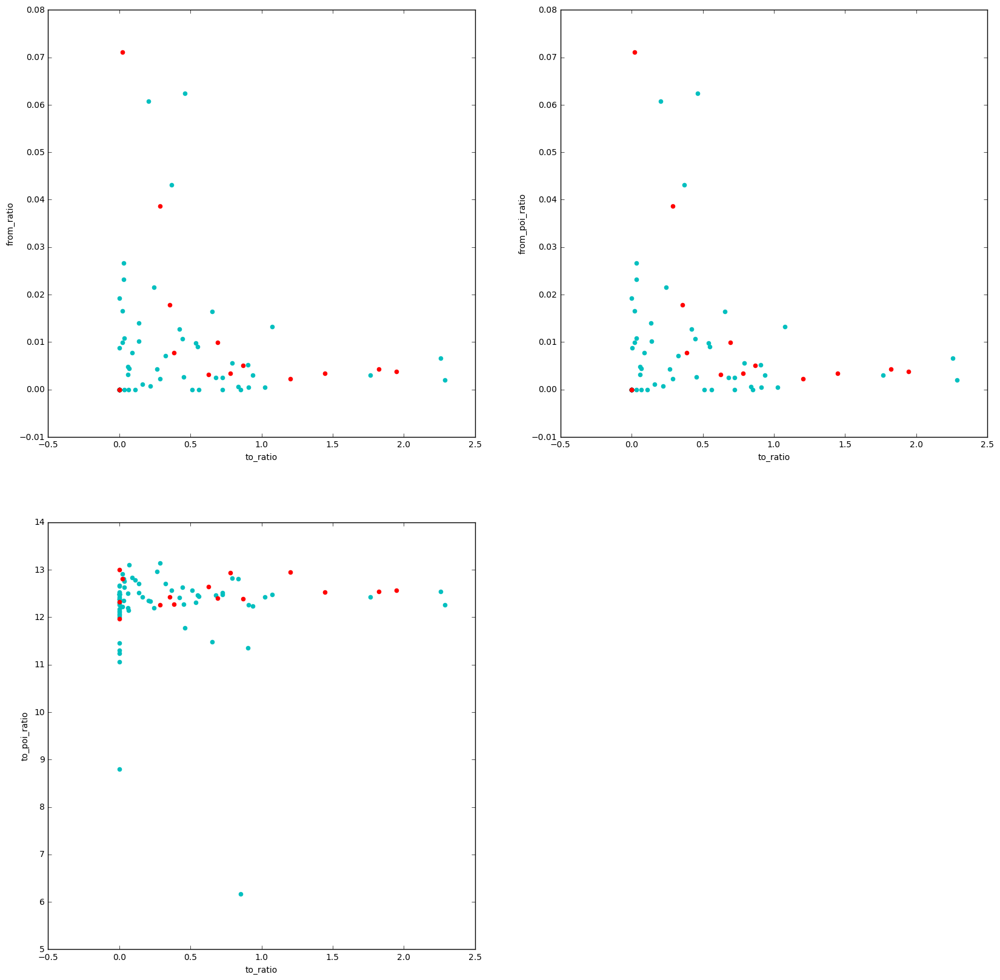

## Machine Learning for Identifying Fraud Based on Enron Email data
### Liang Sun

#### 10/26/2017


#### Summary

This project aims to apply machine learning techniques to identifying Person of Interest (POIs) who may have been involved in fraudulent business practice of Enron Cooperation. The data used for this project is extracted from Enron Corpus which a large database of over 600,000 emails by 158 employees of the Enron company and acquired by the Federal Energy Regulatory Commission during its investigation after the company's collapse. The data set mainly include financial and email features based on which the machine learning algorithms are applied to identify the POIs. 


```python
import sys
import pickle 
sys.path.append("../tools/")
import dill


from sklearn.svm import SVC as SVM
from sklearn.grid_search import GridSearchCV
from sklearn.feature_selection import SelectKBest, chi2
from sklearn.cross_validation import StratifiedShuffleSplit
from sklearn.tree import DecisionTreeClassifier
from sklearn.metrics import precision_score, recall_score, make_scorer
from sklearn.ensemble import RandomForestClassifier, AdaBoostClassifier
from sklearn.pipeline import Pipeline, FeatureUnion
from sklearn.preprocessing import FunctionTransformer

from feature_format import featureFormat, targetFeatureSplit
from tester import dump_classifier_and_data, test_classifier

import matplotlib.pyplot as plt
%matplotlib inline
import numpy as np

from sklearn.preprocessing import MinMaxScaler
from sklearn.decomposition import RandomizedPCA, PCA
```


```python
# Plotting function
def plot_data(labels, X, index_1,index_2,xlab,ylab):
    for i in range(0,len(labels)):
        x_i = X[i]
        if labels[i] == 0:
            plt.scatter(X[i][index_1], X[i][index_2],color ='c')
    for i in range(0,len(labels)):
        x_i = X[i]
        if labels[i] == 1:
            plt.scatter(X[i][index_1], X[i][index_2],color ='r')
    plt.xlabel(xlab)
    plt.ylabel(ylab)
# extract PCA
def pca_extractor(features_finance,n):
    scaler = MinMaxScaler()
    finance_scaler = scaler.fit(features_finance)
    features_finance = finance_scaler.transform(features_finance)
    pca = RandomizedPCA(n_components=n,whiten=True).fit(features_finance)
    features_finance = pca.transform(features_finance)
    features_finance = np.array(features_finance)

    return pca, features_finance

def maxmin_PR_score_fn(labels, predictions):
    precision = precision_score(labels,predictions)
    recall = precision_score(labels,predictions)
    return min(precision,recall)
maxmin_PR_scorer  = make_scorer(maxmin_PR_score_fn, greater_is_better=True)
```


```python
### Task 1: Select what features you'll use.
### features_list is a list of strings, each of which is a feature name.
### The first feature must be "poi".

# load the dictionary containing the dataset
data_dict = pickle.load(open("final_project_dataset_modified.pkl", "r") )

# explore what is in the data_dict
all_features = data_dict[data_dict.keys()[1]].keys()
all_features
```


    ['salary',
     'to_messages',
     'deferral_payments',
     'total_payments',
     'exercised_stock_options',
     'bonus',
     'restricted_stock',
     'shared_receipt_with_poi',
     'restricted_stock_deferred',
     'total_stock_value',
     'expenses',
     'loan_advances',
     'from_messages',
     'other',
     'from_this_person_to_poi',
     'poi',
     'director_fees',
     'deferred_income',
     'long_term_incentive',
     'email_address',
     'from_poi_to_this_person']


Except for "poi", all the other variables fall into two major categories: financial features and email features.


```python
# select the features
features_list = ['poi','salary','bonus'] # You will need to use more features
```


```python

print ""
print "The count of valid values for each feature:"
for feature in all_features:
    f_count = 0
    for person in data_dict.keys():
        if feature in data_dict[person].keys() and data_dict[person][feature] != 'NaN':
            f_count = f_count + 1
    print "-", feature, f_count
```

    
    The count of valid values for each feature:
    - salary 92
    - to_messages 84
    - deferral_payments 37
    - total_payments 122
    - exercised_stock_options 99
    - bonus 79
    - restricted_stock 107
    - shared_receipt_with_poi 84
    - restricted_stock_deferred 17
    - total_stock_value 123
    - expenses 92
    - loan_advances 2
    - from_messages 84
    - other 90
    - from_this_person_to_poi 84
    - poi 143
    - director_fees 16
    - deferred_income 47
    - long_term_incentive 63
    - email_address 109
    - from_poi_to_this_person 84
    


```python
### Task 2: Remove outliers
#format the features
temp_data = data_dict
data = featureFormat(temp_data, features_list, sort_keys = True)
labels, features = targetFeatureSplit(data)


X = features 
index_1 = 0
index_2 = 1
for i in range(0,len(labels)):
    x_i = X[i]
    if labels[i] == 1:
        plt.scatter(X[i][index_1], X[i][index_2],color ='r')
    else:
        plt.scatter(X[i][index_1], X[i][index_2],color ='c')
plt.xlabel("Salary")
plt.ylabel("Bonus")
plt.show();
```





There are a few outliers with either salary above 600,000 or bonus above 4,000,000. 


```python
#remove the outliers based on the graph
rm_count = 0
rm_list  = list()
for person in data_dict:
    data_dict[person]['id'] = rm_count
    rm_count += 1
    is_salary = isinstance(data_dict[person]['salary'],int) 
    is_bonus = isinstance(data_dict[person]['bonus'],int)
    if (is_salary==False):  
        rm_list.append(person)
    if (is_salary & is_bonus): 
        if ((data_dict[person]['bonus']>=6000000.0) or (data_dict[person]['salary']>=600000.0) ):
            rm_list.append(person)
            
```


```python
#remove missing salary from the data
for person in rm_list:
    data_dict.pop(person, 0 )

temp_data = data_dict
data = featureFormat(temp_data, features_list, sort_keys = True)
labels, features = targetFeatureSplit(data)

X = features
index_1 = 0
index_2 = 1

plt.figure(figsize=(20,10))

ax1 = plt.subplot(1,2,1)
for i in range(0,len(labels)):
    x_i = X[i]
    if labels[i] == 1:
        plt.scatter( (X[i][index_1]), (X[i][index_2]),color ='r')
    else:
        plt.scatter( (X[i][index_1]), (X[i][index_2]),color ='c')

plt.xlabel("Salary")
plt.ylabel("Bonus")

ax2 = plt.subplot(1,2,2)
for i in range(0,len(labels)):
    x_i = X[i]
    if labels[i] == 1:
        plt.scatter(np.log(X[i][index_1]+1), np.log(X[i][index_2]+1),color ='r')
    else:
        plt.scatter(np.log(X[i][index_1]+1), np.log(X[i][index_2]+1),color ='c')

plt.xlabel("Log Salary")
plt.ylabel("Log Bonus")

plt.show();
```





Financial vairables need to be log-transformed because they are too large and vary greatly. Their log values will be on quite the same scale.


```python
### Task 3: Create new feature(s) 
features_list = ["poi"]
predictors = ['salary','bonus','total_payments','total_stock_value','expenses',
              "long_term_incentive","other"]
log_features = ['log_'+pred for pred in predictors]
email_features = ['to_ratio','from_ratio','from_poi_ratio','to_poi_ratio']

for key in data_dict:
    value = data_dict[key]
    value_new = {}
    # Adding finance features
    for pred in predictors:
        # Set to 0 for default
        value_new['log_'+pred] = 0
        is_int = isinstance(value[pred],int)
        if is_int:
            value_new[pred]=float(value[pred])
            value_new['log_'+pred] = np.log(float(value[pred]) +1 ) # +1 to avoid divde by 0
    
    # initialize so default is 0
    value_new['to_ratio'] = 0
    value_new['from_ratio'] = 0
    value_new['from_poi_ratio'] = 0
    value_new['to_poi_ratio'] = 0
    
    is_frmPoiToThis = isinstance(value['from_poi_to_this_person'],int)
    is_frmThisToPoi = isinstance(value['from_this_person_to_poi'],int)
    if  is_frmPoiToThis & is_frmThisToPoi:
        value_new['from_poi_to_this_person'] = float(value['from_poi_to_this_person'])
        value_new['from_this_person_to_poi'] = float(value['from_this_person_to_poi'])
        value_new['shared_receipt_with_poi'] = float(value['shared_receipt_with_poi'])
        value_new['to_messages'] = float(value['to_messages'])
        value_new['from_messages'] = float(value['from_messages'])
        poi_total = value_new['to_messages']+value_new['from_messages']+value_new['shared_receipt_with_poi']

        if poi_total!= 0:
            value_new['to_poi_ratio'] =  np.log(value_new['from_this_person_to_poi']/(poi_total) + 1)
            value_new['from_poi_ratio'] =  np.log(value_new['from_this_person_to_poi']/(poi_total) + 1)
        if value_new['to_messages']!= 0:
            value_new['to_ratio'] = np.log(value_new['from_poi_to_this_person']/value_new['to_messages'] + 1)
        if value_new['from_messages']!= 0:
            value_new['from_ratio'] = np.log(value_new['from_poi_to_this_person']/value_new['from_messages'] + 1)

        
    value_new['poi'] = value['poi']
    data_dict[key] = value_new
            
features_list = features_list + email_features + log_features
```


```python
data_dict['ALLEN PHILLIP K']
```


    {'bonus': 4175000.0,
     'expenses': 13868.0,
     'from_messages': 2195.0,
     'from_poi_ratio': 0.0099442416648263168,
     'from_poi_to_this_person': 47.0,
     'from_ratio': 0.021186278122833496,
     'from_this_person_to_poi': 65.0,
     'log_bonus': 15.244625155788022,
     'log_expenses': 9.5374114126563345,
     'log_long_term_incentive': 12.62743078764025,
     'log_other': 5.0304379213924353,
     'log_salary': 12.215805130874553,
     'log_total_payments': 15.316124854012321,
     'log_total_stock_value': 14.36336719153978,
     'long_term_incentive': 304805.0,
     'other': 152.0,
     'poi': False,
     'salary': 201955.0,
     'shared_receipt_with_poi': 1407.0,
     'to_messages': 2902.0,
     'to_poi_ratio': 0.0099442416648263168,
     'to_ratio': 0.016065975371142984,
     'total_payments': 4484442.0,
     'total_stock_value': 1729541.0}


```python

```


```python

```


```python
print 'Total people :', len(data_dict.keys())
poi_count = [k for k,v in data_dict.items()if v['poi']==1]
print 'POIs count:' ,len(poi_count) 
```

    Total people : 89
    POIs count: 15
    


```python
### Store to my_dataset for easy export below.
my_dataset = data_dict

### Extract features and labels from dataset for local testing
data = featureFormat(my_dataset, features_list, sort_keys = True)
labels, features = targetFeatureSplit(data)
```


```python
for i in range(len(features_list)):
    print("Feature # "+str(i-1)+" is " +features_list[i])
```

    Feature # -1 is poi
    Feature # 0 is to_ratio
    Feature # 1 is from_ratio
    Feature # 2 is from_poi_ratio
    Feature # 3 is to_poi_ratio
    Feature # 4 is log_salary
    Feature # 5 is log_bonus
    Feature # 6 is log_total_payments
    Feature # 7 is log_total_stock_value
    Feature # 8 is log_expenses
    Feature # 9 is log_long_term_incentive
    Feature # 10 is log_other
    

Then, I will extract features and reduce the dimensionality through Principal Component Analysis.

##### Financial features 


```python

```


```python
X = features
plt.figure(figsize=(20,6))
ax1 = plt.subplot(1,2,1)
plot_data(labels, X, 4,5,'log salary','log bonus')
ax2 = plt.subplot(1,2,2)
plot_data(labels, X, 4,6,'log salary','log total payments')
plt.show()
```





```python
plt.figure(figsize=(20,6))
ax1 = plt.subplot(1,2,1)
plot_data(labels, X, 4,7,'log salary','log total stock value')
ax2 = plt.subplot(1,2,2)
plot_data(labels, X, 4,8,'log salary','log expenses')
plt.show()
```





```python
plt.figure(figsize=(20,6))
ax1 = plt.subplot(1,2,1)
plot_data(labels, X, 4,9,'log salary','log long term incentive')
ax2 = plt.subplot(1,2,2)
plot_data(labels, X, 4,10,'log salary','log other')
plt.show();

```





### Principal component analysis

As financial features are correlated, use PCA for dimensionality reduction.


```python
### Extract features and labels from dataset for local testing
data = featureFormat(my_dataset, features_list, sort_keys = True)
labels, features = targetFeatureSplit(data)
labels_array = np.array(labels)
features_array = np.array(features)

```


```python


for n_features in range(1,7):
    financial_features = features_array[:,range(5,11)]
    pca_finance, finance_pc_features = pca_extractor(financial_features,n_features)
    print('Explained variance by ' + str(n_features) + ' principal components = ', sum(pca_finance.explained_variance_ratio_))


```

    ('Explained variance by 1 principal components = ', 0.36840511081089311)
    ('Explained variance by 2 principal components = ', 0.59078801780514534)
    ('Explained variance by 3 principal components = ', 0.76533810511793687)
    ('Explained variance by 4 principal components = ', 0.88982187025723425)
    ('Explained variance by 5 principal components = ', 0.95242190865133314)
    ('Explained variance by 6 principal components = ', 1.0000000000000002)
    

#### Choose 4 PCs as they explain more than 85% of covariance


```python
pca_finance, finance_pc_features = pca_extractor(financial_features,4) # Choose 4 PCs
features_array = np.concatenate((features_array,finance_pc_features), axis=1)  # Concanctenate PC features
```


```python
plt.figure(figsize=(15,10))

ax1 = plt.subplot(2,2,1)
plot_data(labels, finance_pc_features, 0,1,'PC1','PC2')
ax1 = plt.subplot(2,2,2)
plot_data(labels, finance_pc_features, 0,2,'PC1','PC3')
ax1 = plt.subplot(2,2,3)
plot_data(labels, finance_pc_features, 1,2,'PC1','PC4')

plt.show()
```





```python
i_count = 0
for key in my_dataset:
    my_dataset[key]['PC1'] = finance_pc_features[i_count][0]
    my_dataset[key]['PC2'] = finance_pc_features[i_count][1]
    my_dataset[key]['PC3'] = finance_pc_features[i_count][2]
    my_dataset[key]['PC4'] = finance_pc_features[i_count][3]
    i_count+=1

```

#### Email features

Use skbest to extract 3-best email features


```python
plt.figure(figsize=(20,20))
ax1 = plt.subplot(2,2,1)
plot_data(labels, X, 1,2,'to_ratio','from_ratio')
ax2 = plt.subplot(2,2,2)
plot_data(labels, X, 1,3,'to_ratio','from_poi_ratio')
ax3 = plt.subplot(2,2,3)
plot_data(labels, X, 1,4,'to_ratio','to_poi_ratio')
plt.show()
```





I used selectKbest to get important features. The 3 best emal features were, 'log(to_poi/total_to)','log(from_poi/total_to)' and 'log(to_msg/total_msg)'.


```python
features_eml = np.array(features_array[:,range(1,5)])
chi2_selector = SelectKBest(chi2, k=3)
email_3best_features = chi2_selector.fit_transform(features_eml, labels)
index1 = np.where(email_3best_features[0,0]==features_array[0,:])[0][0]
index2 = np.where(email_3best_features[0,1]==features_array[0,:])[0][0]
index3 = np.where(email_3best_features[0,2]==features_array[0,:])[0][0]

print("Three best features are " + features_list[index1] + ", " + features_list[index2] + " and " + features_list[index3] )
```

    Three best features are to_ratio, from_ratio and to_poi_ratio
    

#### Used f1-score for scoring, as both precision and recall are important in an unbalaced dataset

Tried 4 classifiers
- SVC
- Decision tree
- Random forest
- Adaptive boosting


```python
# Features to make model
features_model = ['poi','PC1','PC2','PC3','PC4','to_ratio ','to_poi_ratio','from_ratio']
data = featureFormat(my_dataset, features_list, sort_keys = True)
labels_model, features_model = targetFeatureSplit(data)
features_model = np.array(features_model)
labels_model = np.array(labels_model)
```


```python
# Test-train split for Cross validation
sss = StratifiedShuffleSplit(labels_array, 25, test_size=0.1, random_state=42)

```


```python
type(labels_model)
```


    numpy.ndarray


```python

```


```python
## SVM model
param_grid = {
         'C': [1,10,20,30,100,500,1000,5000],
          'gamma': [.25,.5,.75],
          }


SVM_search = GridSearchCV(SVM(kernel='rbf', class_weight='balanced'), param_grid,cv=sss,scoring=maxmin_PR_scorer)
SVM_search = SVM_search.fit(features_model, labels_model)
SVM_classifier = SVM_search.best_estimator_

print("best score for SVM = " + str(SVM_search.best_score_))
```

    E:\Anaconda\lib\site-packages\sklearn\metrics\classification.py:1074: UndefinedMetricWarning: Precision is ill-defined and being set to 0.0 due to no predicted samples.
      'precision', 'predicted', average, warn_for)
    

    best score for SVM = 0.18
    


```python
## Decision tree
param_grid = {
         'min_samples_split': [2 ,3,4,5,6,7,8],
         'max_depth':[2,3,4,5,6],
         'criterion':['gini','entropy']
        }

DT_base = DecisionTreeClassifier(random_state=42)
DT_search = GridSearchCV(DT_base, param_grid,cv=sss,scoring=maxmin_PR_scorer)
DT_search = DT_search.fit(features_model, labels_model)
DT_classifier = DT_search.best_estimator_

print("best score for DT = " + str(DT_search.best_score_))
```

    best score for DT = 0.411333333333
    


```python
DT_classifier
```


    DecisionTreeClassifier(class_weight=None, criterion='gini', max_depth=6,
                max_features=None, max_leaf_nodes=None, min_samples_leaf=1,
                min_samples_split=4, min_weight_fraction_leaf=0.0,
                presort=False, random_state=42, splitter='best')


```python
## Random Forest
param_grid = {
         'min_samples_split': [2 ,3,4,5,6,7,8],
         'max_depth':[2,3,4,5,6],
         'criterion':['gini','entropy']
        }

RF_base = RandomForestClassifier(random_state=42)
RF_search = GridSearchCV(RF_base, param_grid,cv=sss,scoring=maxmin_PR_scorer)
RF_search = RF_search.fit(features_model, labels_model)
RF_classifier = RF_search.best_estimator_

print("best score for RF = " + str(RF_search.best_score_))
```

    best score for RF = 0.16
    


```python
## Adaptive boosting algorithm
param_grid = {
         'learning_rate': [.1,.2,.3,.4,.5,.6,.7,.8,.9,1.0],
          'n_estimators': [5,10, 25,50,75,100],
        }

ADB_search = GridSearchCV(AdaBoostClassifier(), param_grid,cv=sss,
                       scoring=maxmin_PR_scorer)
ADB_search.fit(features_model, labels_model)
ADB_classifier = ADB_search.best_estimator_

print("best score for ADB = " + str(ADB_search.best_score_))
```

    best score for ADB = 0.393333333333
    


```python
## Putting all in 1 pipeline
```


```python
predictors_list = features_list[1:]
predictors_list[0:4]

```


    ['to_ratio', 'from_ratio', 'from_poi_ratio', 'to_poi_ratio']


```python
# Define SSS
sss = StratifiedShuffleSplit(labels_array, 25, test_size=0.1, random_state=42)

# features
features_list = ['poi','to_ratio', 'from_ratio', 'to_poi_ratio','from_poi_ratio']
predictors = ['salary','bonus','total_payments','total_stock_value','expenses',
              "long_term_incentive","other"]
log_features = ['log_'+pred for pred in predictors]
features_list = features_list + log_features

# extract data
data = featureFormat(my_dataset, features_list, sort_keys = True)
labels_model, features_model = targetFeatureSplit(data)
features_model = np.array(features_model)
labels_model = np.array(labels_model)

# Base k-best selector
chi2_selector = SelectKBest(chi2)


param_grid = {
          'clf__learning_rate': [.2,.4,.6,.8,1.0],
          'clf__n_estimators': [5,10, 25,50,75,100],
          'features__financial_PC__PCA__n_components':[3,4,5],
          'features__Email_features__SelectK__k':[2,3,4]  
          }


pipeline_ADB = Pipeline([
    ('features', FeatureUnion([
        ('financial_PC', Pipeline([
            ('extractor', FunctionTransformer(lambda x: x[:, range(4,11)])),
            ('scaler', MinMaxScaler()),
            ('PCA',   PCA()),
        ])),
        ('Email_features', Pipeline([
            ('extract', FunctionTransformer(lambda x: x[:, range(0,4)])),
            ('SelectK', SelectKBest(chi2)),
        ]))            
                    
    ])),
    ('clf',  AdaBoostClassifier(DecisionTreeClassifier(max_depth=4,criterion='entropy', min_samples_split=4), random_state=2017))
])

gridCV_object = GridSearchCV(estimator = pipeline_ADB, 
                                         param_grid = param_grid, 
                                         cv = sss,scoring=maxmin_PR_scorer
                                        )


gridCV_object.fit(features_model,labels_model)
ADB_best_classifier = gridCV_object.best_estimator_
```


```python
dump_classifier_and_data(ADB_best_classifier, my_dataset, features_list)
```


```python
test_classifier(ADB_best_classifier,my_dataset,features_list,folds = 1000)
```

    Pipeline(steps=[('features', FeatureUnion(n_jobs=1,
           transformer_list=[('financial_PC', Pipeline(steps=[('extractor', FunctionTransformer(accept_sparse=False,
              func=<function <lambda> at 0x000000000BAEB6D8>, pass_y=False,
              validate=True)), ('scaler', MinMaxScaler(copy=True, feature_ra...dom_state=None, splitter='best'),
              learning_rate=0.4, n_estimators=50, random_state=2017))])
    	Accuracy: 0.76489	Precision: 0.45626	Recall: 0.30250	F1: 0.36380	F2: 0.32436
    	Total predictions: 9000	True positives:  605	False positives:  721	False negatives: 1395	True negatives: 6279
    
    


```python

```
